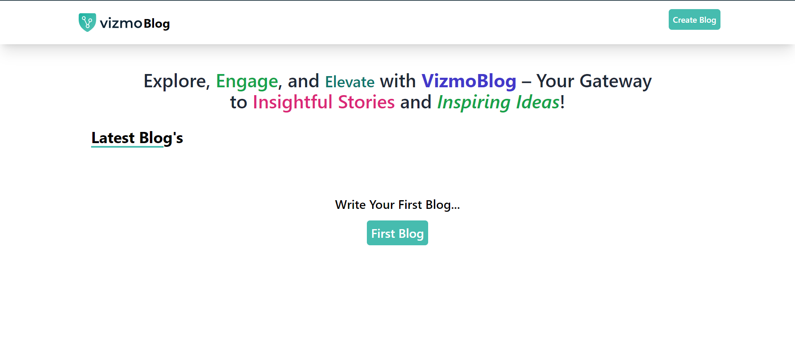
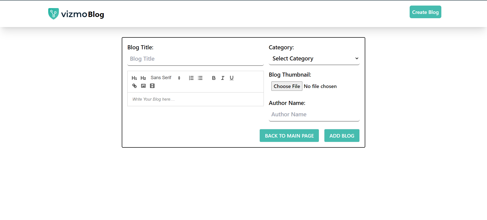
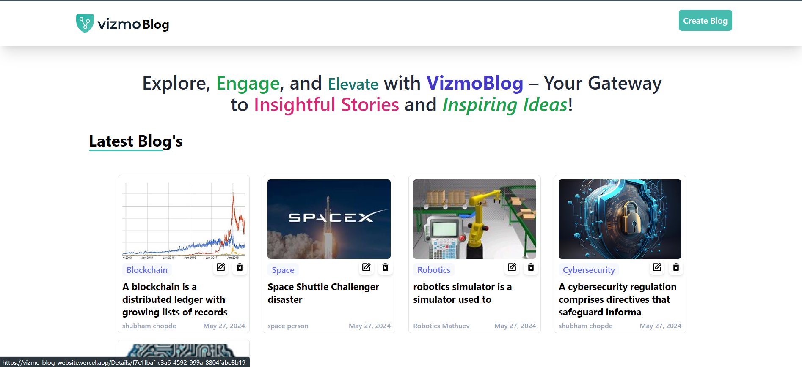
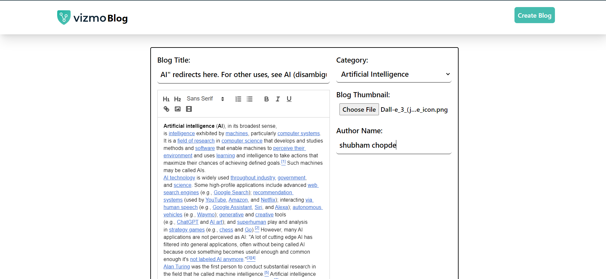
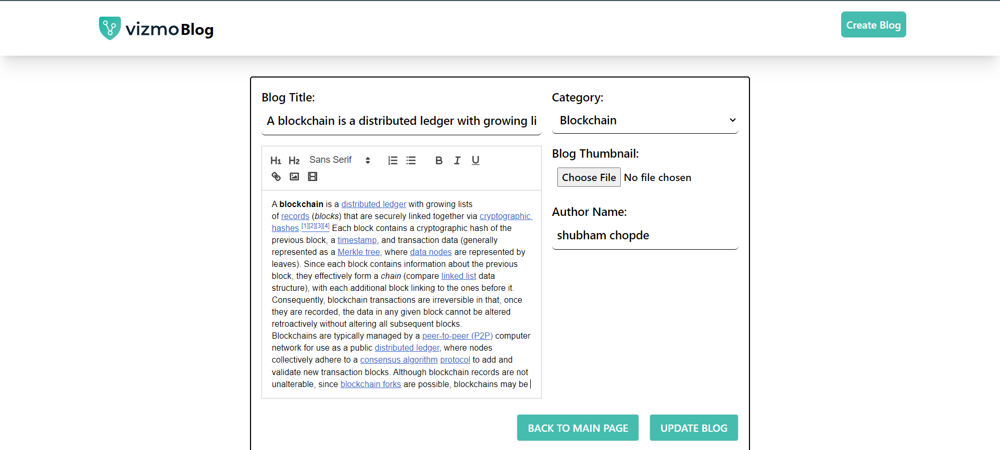
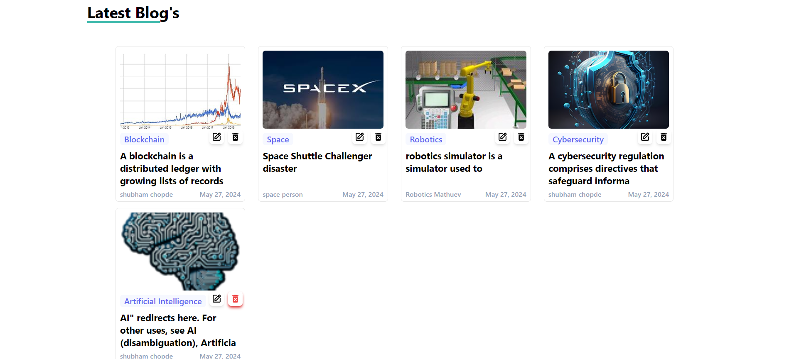

# Blogging Application

## Overview

This project is a blogging application built with React. It features a rich text editor, image upload functionality, and form validation. The application allows users to create, edit, and manage blog posts, including the ability to upload and display images via Cloudinary. The project utilizes modern React hooks and context API for state management, and React Router for navigation.

## Features

1. **Rich Text Editor**: Utilizes `ReactQuill` to provide a full-featured rich text editor for creating and editing blog content.
2. **Image Upload**: Integrates Cloudinary for image uploads, allowing users to upload images and use them as blog thumbnails.
3. **Form Validation**: Includes client-side validation to ensure all required fields are filled before submission.
4. **Post Management**: Supports adding new posts and editing existing ones.
5. **Routing**: Implements `React Router` for seamless navigation between different pages.

## Project Structure

- **Context API**: Used for global state management.
- **React Hooks**: Utilized for managing state and side effects.
- **FormData and Fetch API**: Used for handling file uploads to Cloudinary.
- **React Router**: Manages the application's routing.

## live Demo
- check out my project Demo [click Here](https://vizmo-blog-website.vercel.app/)

## Images

# Home Page

# Editor Page

# Blogs Page

# Edit Blog Page

# update

# Delete

